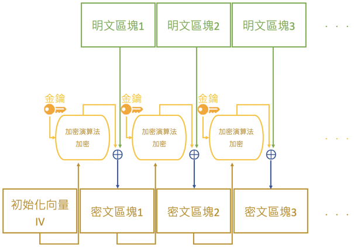
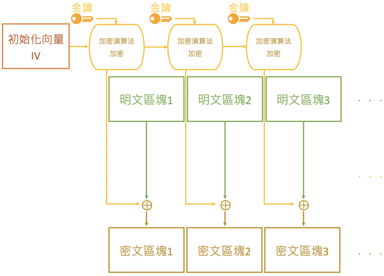

# 密碼學基礎.md

## 雜湊（HASH）
- 單向的加密演算法
- A 產生出來 B，B 無法推算回 A
- 特性
    1. 輸入的內容有非常少的改變，算出來的結果也會整個不同
    2. 不管輸入的內容多長或多短，輸出的內容長度固定

## 碰撞（Collision）
- 兩個不同的內容A與內容B，都利用同樣的HASH演算法得到同樣的內容C

## 對稱式加密與非對稱式加密差別
- 對稱式密碼學當中加解密通常是使用同一把金鑰
- 非對稱式加密中，加解密為不同的金鑰
    - 公鑰與私鑰
    - 公鑰加密的內容必須用私鑰才能解開

## 密碼的加密模式
- ECB
    - 將明文所切成的明文區塊直接當成加密演算法的輸入
    - 
- CBC
    - 跟ECB模式的運作原理很類似，但是加密中又加了前一個密文區塊做XOR運算
    - 初始化向量(Initial Vector)
        - 沒有任何的密文區塊了
        - 隨機數來產生與密文區塊同樣大小的區塊叫初始化向量(Initial Vector)
    - 
- CFB
    - CFB模式可以說是不同順序的CBC模式版本
    - 
- OFB
    - 加密演算法的output會”feedback”回加密演算法的input
    - 
- CTR 
    - 在CTR模式中用了計數器counter的概念取代初始化向量
    - 

## SSL/TLS
- 一種通訊協定
- 替傳輸中的訊息進行資料的安全及完整

## 參考
1. https://notes.andywu.tw/2019/%E5%AF%86%E7%A2%BC%E7%9A%84%E5%8A%A0%E5%AF%86%E6%A8%A1%E5%BC%8Fecb-cbc-cfb-ofb-ctr/