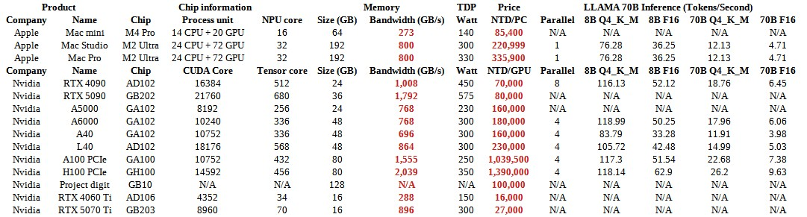
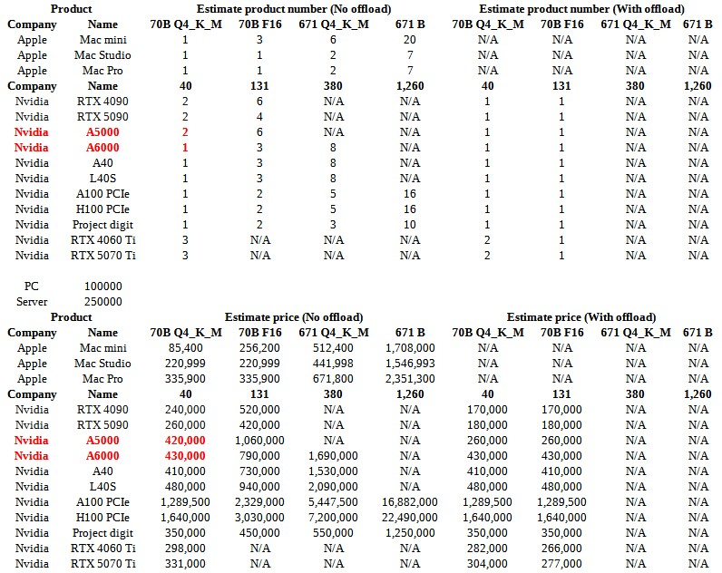

# DeepSeek R1 @ Local

## DeepSeek R1 介紹

- 深度求索（DeepSeek）於 2025/1/20 日發布的人工智慧大型語言模型 (LLM)
- 專門適用於數學、編碼和邏輯等任務，性能對標 OpenAI o1
- 以 **MIT 協議** 發布，完全開源權重，但並未提供訓練 Code

### 模型資訊

- 除了完整版的 DeepSeek R1 之外，DeepSeek 團隊還提供不同大小的知識蒸餾（Knowledge Distillation）模型
    - 讓其他小型 LLM 模仿 DeepSeek R1 的預測分布
        - 這些模型的性能與 DeepSeek R1 相比有所降低，但是速度更快，更適合部署在生產環境中
        - 但是只有 DeepSeek R1 是真的 DeepSeek R1，其他模型只是知識蒸餾的結果
- 所有模型列表
    - DeepSeek R1 - 671B
    - Based on LLaMA
        - DeepSeek R1 Distill Llama - 8B
        - DeepSeek R1 Distill Llama - 70B
    - Based on Qwen
        - DeepSeek R1 Distill Qwen - 1.5B
        - DeepSeek R1 Distill Qwen - 7B
        - DeepSeek R1 Distill Qwen - 14B
        - DeepSeek R1 Distill Qwen - 32B

### 模型性能

| Model                         | AIME 2024 pass@1 | MATH-500 pass@1 | GPQA Diamond pass@1 | LiveCodeBench pass@1 | CodeForces rating |
|:-----------------------------:|:----------------:|:---------------:|:-------------------:|:--------------------:|:-----------------:|
| GPT-4o-0513                   | 9.3              | 74.6            | 49.9                | 32.9                 | 759               |
| Claude-3.5-Sonnet-1022        | 16               | 78.3            | 65                  | 38.9                 | 717               |
| o1-mini                       | 63.6             | 90              | 60                  | 53.8                 | **1820**          |
| QwQ-32B                       | 44               | 90.6            | 54.5                | 41.9                 | 1316              |
| DeepSeek-R1-Distill-Qwen-1.5B | 28.9             | 83.9            | 33.8                | 16.9                 | 954               |
| DeepSeek-R1-Distill-Qwen-7B   | 55.5             | 92.8            | 49.1                | 37.6                 | 1189              |
| DeepSeek-R1-Distill-Llama-8B  | 50.4             | 89.1            | 49                  | 39.6                 | 1205              |
| DeepSeek-R1-Distill-Qwen-14B  | 69.7             | 93.9            | 59.1                | 53.1                 | 1481              |
| DeepSeek-R1-Distill-Qwen-32B  | **72.6**         | 94.3            | 62.1                | 57.2                 | 1691              |
| DeepSeek-R1-Distill-Llama-70B | 70               | **94.5**        | **65.2**            | **57.5**             | 1633              |
| DeepSeek-R1                   | **79.8**         | **97.3**        | **71.5**            | **65.9**             | **2029**          |

## Large Language Model (LLM) Ram composition

- 以下計算使用
    - 8B 模型
    - f16 精度 (16 位元)

### Traning

| Training          | Size (GB) |
|:-----------------:|:---------:|
| Model Weights     | 16        |
| Gradients         | 16        |
| Optimizer States  | ~64       |
| Activations       | 20~50     |
| **Sum**           | 116~146   |

### Inference

| Reference           | Size (GB) |
|:-------------------:|:---------:|
| Model Weights       | 16        |
| Gradients           | 2~5       |
| Activations (Part)  | 2~5       |
| **Sum**             | 20~26     |

## 本地運行

### 記憶體需求量

| Model | F16       |
|:-----:|:---------:|
| 8B    | 4.96 GB   |
| 32B   | 59.84 GB  |
| 70B   | 131.42 GB |
| 671B  | 1260 GB   |

### 模型量化

- 犧牲精度以換取更小的記憶體需求

#### 70B 模型量化效能

| Quantization | Size (GiB) | Delta (Size) | Perplexity (wiki.test) | Delta (FP16) |
|:------------:|:----------:|:------------:|:----------------------:|:------------:|
| Q2_K_S       | 22.79      | 17.34%       | 5.4334 +/- 0.0325      | 91.94%       |
| Q2_K         | 24.56      | 18.69%       | 4.7763 +/- 0.0274      | 68.73%       |
| Q3_K_S       | 28.79      | 21.91%       | 3.6502 +/- 0.0192      | 28.95%       |
| Q3_K_M       | 31.91      | 24.28%       | 3.3617 +/- 0.0172      | 18.75%       |
| Q3_K_L       | 34.59      | 26.32%       | 3.3016 +/- 0.0168      | 16.63%       |
| Q4_K_S       | 37.58      | 28.59%       | 3.0050 +/- 0.0148      | 6.15%        |
| **Q4_K_M**   | 39.6       | **30.13%**   | 2.9674 +/- 0.0146      | **4.83%**    |
| **Q5_K_S**   | 45.32      | **34.48%**   | 2.8843 +/- 0.0141      | **1.89%**    |
| Q5_K_M       | 46.52      | 35.40%       | 2.8656 +/- 0.0139      | 1.23%        |
| Q6_K         | 53.91      | 41.02%       | 2.8441 +/- 0.0138      | 0.47%        |
| Q8_0         | 69.83      | 53.13%       | 2.8316 +/- 0.0138      | 0.03%        |
| F16          | 131.43     | 100.00%      | 2.8308 +/- 0.0138      | 0.00%        |

#### 預估量化後記憶體需求

| Model | Q4_K_M       | F16       |
|:-----:|:------------:|:---------:|
| 8B    | 4.58 GB      | 14.96 GB  |
| 32B   | **18.32**    | 59.84 GB  |
| 70B   | **39.59 GB** | 131.42 GB |
| 671B  | **680 GB**   | 1260 GB   |

## 設備需求

### 可用運算晶片/設備列表

- 不考慮市價漲跌
- 選配以 AI 最佳化為基準
- Nvidia 顯卡會搭配有以下規格的設備
    - PCI Express 5.0
    - 128 GB DDR5
    - 10K MB/S R/W SSD

### 預估設備價格

### 論壇測試結果 R1-Distill-Qwen-32B 模型推理

| Chip       | Number | Arch  | Bit      | Tokens/Second | Thread |
|:----------:|:------:|:-----:|:--------:|:-------------:|:------:|
| M3 Max     | 1      | MLX   | MLX-8bit | 19            | 1      |
| M3 Max     | 1      | MLX   | MLX-8bit | 10.57         | 1      |
| M3 Max     | 1      | GGUF  | Q4_K_M   | 15.93         | 1      |
| M3 Max     | 1      | GGUF  | Q8_0     | 7.5           | 1      |
| M4 Max     | 1      | GGUF  | Q4_K_M   | 18.44         | 1      |
| RTX 4090   | 2      |       | fp8      | 949.5         | 64     |
| RTX 3090   | 2      |       | int4     | 651.7         | 64     |
| Tesla P100 | 1      |       | fp16     | 17.13         | 1      |

